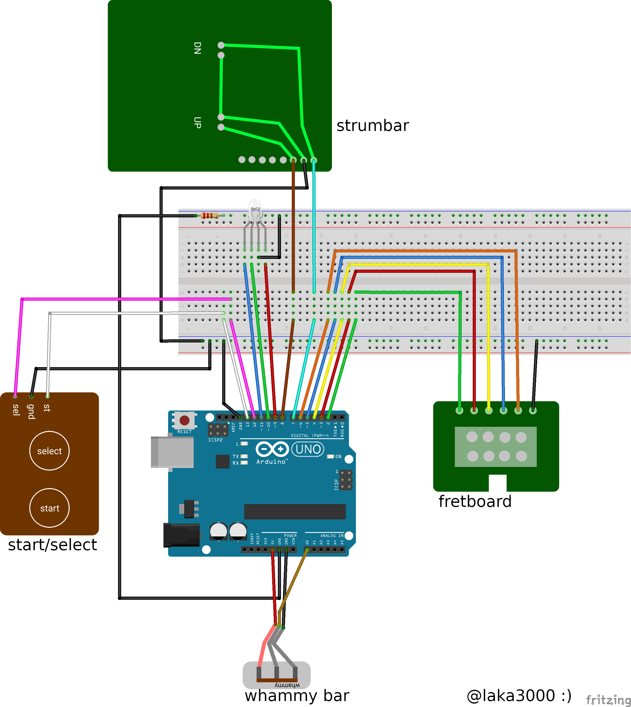

# PS3 Les Paul To UnoJoy

## Description

Turns your PS3 Les Paul Guitar Hero controller into a PC compatible joystick.
RGB supported.

## Setup

This project was setup with an Arduino Uno, if you're using another model, some chages to the circuits and code may be required.

### Step 1

Using the Arduino IDE, upload `LesPaulToUnoJoy.ino` to your Arduino.

---

### Step 2

Disassemble your controller, and wire the circuit accordingly

  

If you're not using RGB, follow the circuit laid on `circuit-no-rgb.png`.

---

### Step 3

Turn your Arduino into a joystick using [UnoJoy](https://github.com/AlanChatham/UnoJoy)

---

This guide was based on this [Google doc tutorial](https://docs.google.com/document/d/1klulqILXcG8Ejb7QdEfWpLf_Qf7sVCPiOCc8PppHsiM/), additional information might be found there.
I'm not sure who the author is, but if you do, let me know and I'll credit them.

This guide was built upon the official Les Paul Controller for the PS3, other models might be compatible, but I'll need to verify the pins and inputs yourself.
